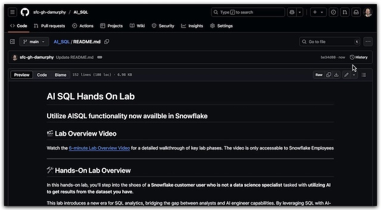

# AI SQL Hands On Lab
**Utilize AISQL functionality now availble in Snowflake**
---

## 🎬 Lab Overview Video

[](images/AISQL_overview_vid.mp4)

---
## 🛠️ Hands-On Lab Overview

In this hands-on lab, you'll step into the shoes of **a Snowflake customer user who is not a data science specialist** tasked with **utilizing AI to get results from the dataset you have**.

This lab introduces a new era for SQL analytics, bridging the gap between analysts and AI engineer capabilities. By leveraging SQL with AI-powered operators in Snowflake, analysts can easily access and analyze multimodal data at scale. The solution combines simple SQL syntax with high-performance processing at a lower cost, delivering trusted insights across the enterprise.

### 📋 What You’ll Do:
- **[Part 1:](/lab_instructions/Part1_EquityResearch.md)** You will utilize unstructured data found in PDF Documents to complete an Equity Anlaysis using AISQL
  * Ingest text data related to stock market information
  * Ingest PDF documents and parse them into a table for analysis by Cortex
  * Filter data using AI SQL
  * Aggregate data using AI SQL
  * Summarize data using AI SQL
- **[Part 2:](/lab_instructions/Part2_RestaurantReview.md)** The second part of the lab will examine restaurant reviews and pictures of menu items. This data will be aggregated to draw conclusions about reviews available on Doordash. AI will also be used to join restaurant images with text data for multimodal analysis in a single place.
  * Ingest text data related to DoorDash reviews
  * Ingest Images and generate descriptions using Cortex to analyze the images
  * Filter data using AI SQL
  * Aggregate data using AI SQL
  * Summarize data using AI SQL

### ⏲️ Estimated Lab Timeline

Provide a brief agenda to help SEs understand pacing:

- **Part 1:** ~20 min
- **Part 2:** ~30 min
 
---

## 📖 Table of Contents

- [Why this Matters](#-why-this-matters)
- [Suggested Discovery Questions](#-suggested-discovery-questions)
- [Repository Structure](#-repository-structure)
- [Prerequisites & Setup Details](#-prerequisites--setup-details)
- [Estimated Lab Timeline](#%EF%B8%8F-estimated-lab-timeline)
- [Troubleshooting & FAQ](#%EF%B8%8F-troubleshooting--faq)
- [Cleanup & Cost-Stewardship Procedures](#-cleanup--cost-stewardship-procedures)
- [Links to Internal Resources & Helpful Documents](#-links-to-internal-resources--helpful-documents)

---

## 📌 Why this Matters

- **Business value:** 
  * **More Users Leveraging Cortex:** Everyday analysts can be transformed into AI engineers without complex coding.
  * **AI-powered multi-modal data operations:** Unlock powerful capabilities like classification, summarization, extraction, sentiment analysis, translation, audio transcript, and image search, all using SQL queries.
  * **Easily combine AI operations with traditional SQL functions:** JOIN, FILTER, and AGGREGATE can be used to analyze both structured and unstructured data together in a single table, all within Snowflake.
  * **Zero setup needed:** Query structured and unstructured data in a single table with existing SQL knowledge. No new tools or languages are required, democratizing AI across your enterprise, and providing AI-powered insights in minutes, not weeks. There's no model training or complex pipelines; just write your query and go.
- **Pricing impact:** Customers will incure costs for tokens which can be tracked in account_usage tables.
- **Customer stories:** Link to decks, blogs or other information to promote reference stories.

---

## ❓ Suggested Discovery Questions

- "How are you currently handling users who want to leverage AI but only know SQL?"
- "What metrics matter most when evaluating the use of AI by everyone in the company to get better and faster actionable items?"
- "Have you faced any security or compliance roadblocks with user personas who dont know data science or ML practices?"
- "How would you customize this pattern for your environment?"

---

## 📂 Repository Structure

```bash
├── README.md                # Main entry point
├── config                   # Configuration for DORA            
├── notebooks                # Interactive notebooks
├── data                     # Datasets (CSV, JSON) or external links
│ ├──AISL Equity Research
│ │ ├──EquityDOCS            # Unstructured data (PDFs) for Lab
│ ├──AISL Resturant Review
│ │ ├──Datasets              # Doordash Data
│ │ ├──Extras                # Python Helper file for notebooks
│ │ ├──Food Images           # Unstructured data (images) for Lab
├── lab_instructions         # Step-by-step detailed instructions
└── troubleshooting          # Common issues and resolutions
```
---

## ✅ Prerequisites & Setup Details

Internally helpful setup requirements:

- **Knowledge prerequisites:** General knowledge of LLMs and their basic function as well as ability to use the Snowflake Snowsight interface
- **Account and entitlement checks:** At this time all features are PuPr or GA so there are no account settings to modify
- **Hardware/software:** Not all deployments will have the needed LLMs to run the analysis.  You might need to run the following to enable cross cloud calls
```sql
ALTER ACCOUNT SET CORTEX_ENABLED_CROSS_REGION = 'ALL';
```

---


## ⚠️ Troubleshooting & FAQ

Common errors and resolutions:


> * **Issue:** AttributeError: 'NoneType' object has no attribute 'query_scan_data_frame'
> * **Cause:** This happens when a cell in notebooks ends with a commented line of code
> * **Solution:** Remove the commented line in the code at the end of the cell


> * **Issue:** NotebookSQLException: 100351: Request failed for external function COMPLETE$V6 with remove service error: ...
> * **Cause:** This happens when the model is busy and fails after a certain amount of time has passed
> * **Solution:** try using `claude-3-sonnet` as the model or try another time as this will complete it just depends on the loads on the model

---

## 🧹 Cleanup & Cost-Stewardship Procedures

🗑 **Cleanup Instructions:**
- Drop the warehouses created in the lab:
```sql
 DROP warehouse IF EXISTS WH_AISQL_HOL; 
 ```
- Drop the database created in the lab:
```sql
 DROP database IF EXISTS AISQL_HOL; 
 ```


---

## 🔗 Links to Internal Resources & Helpful Documents

- [Snowflake Documentation](https://docs.snowflake.com/en/user-guide/snowflake-cortex/aisql)
- [SLACK - #feat-ai-sql](#)

---

## 👤 Author & Support

- **Lab created by:** Dan Murphy – SE Enablement Senior Manager
- **Created on:** July 21, 2025 | **Last updated:** July 21, 2025

💬 **Need Help or Have Feedback?**  
- Slack DM: [@dan.murphy](https://snowflake.enterprise.slack.com/team/WEJR92JS2)  
- Email: [dan.murphy@snowflake.com](mailto:dan.murphy@snowflake.com)

🌟 *We greatly value your feedback to continuously improve our HOL experiences!*
